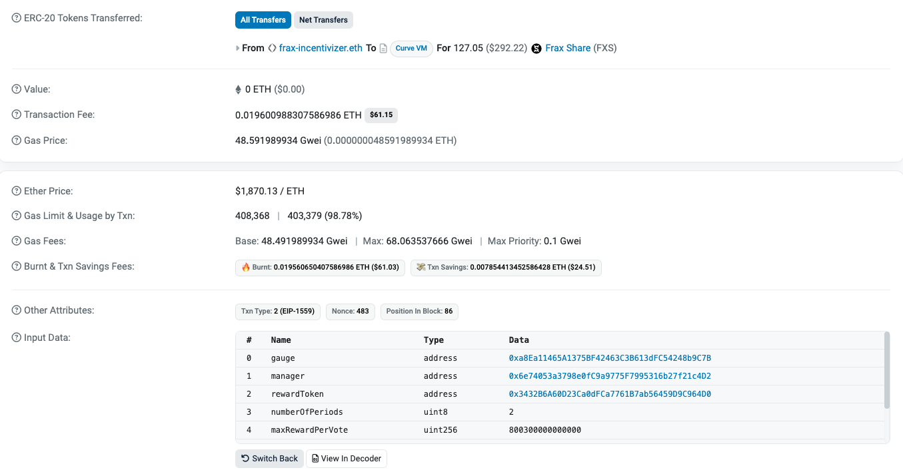
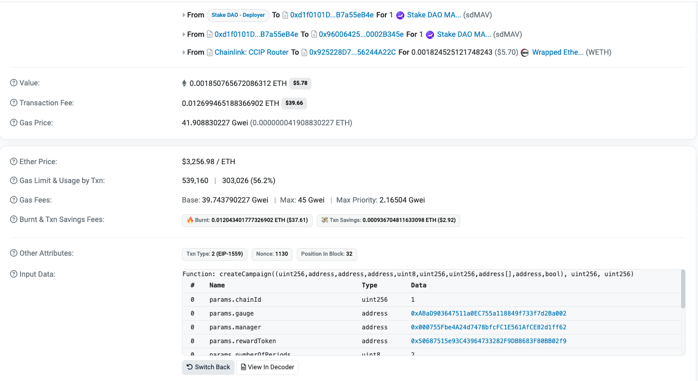

# VoteMarket V2 Integration Guide

This guide is designed to help developers integrate and migrate their applications to the new VoteMarket V2 architecture. The new version introduces some changes in interaction with the platform, due to native cross-chain operations.

## Contents

- [VoteMarket V2 Integration Guide](#votemarket-v2-integration-guide)
  - [Contents](#contents)
  - [Quick Reference](#quick-reference)
    - [Contract Addresses \& Deployments](#contract-addresses--deployments)
  - [Campaign Creation](#campaign-creation)
  - [Campaign Management](#campaign-management)
  - [Campaign Closing](#campaign-closing)
  - [Claiming Campaign Rewards](#claiming-campaign-rewards)
  - [Using the Bundler for Batch Operations](#using-the-bundler-for-batch-operations)
    - [Proof Submissions](#proof-submissions)
    - [Claims](#claims)
      - [Update Epochs](#update-epochs)

## Quick Reference

### Contract Addresses & Deployments

| Contract              | Networks                                    | Address                                    |
|----------------------|---------------------------------------------|--------------------------------------------|
| CampaignRemoteManager| Ethereum, Arbitrum, Base, Optimism, Polygon | `0xd1f0101Df22Cb7447F486Da5784237AB7a55eB4e` |
| CCIP Adapter         | Ethereum, Arbitrum, Base, Optimism, Polygon | `0x4200740090f72e89302f001da5860000007d7ea7` |
| VoteMarket           | Arbitrum, Base, Optimism, Polygon          | `0x5e5C922a5Eeab508486eB906ebE7bDFFB05D81e5` |
| Oracle               | Arbitrum, Base, Optimism, Polygon          | `0x36F5B50D70df3D3E1c7E1BAf06c32119408Ef7D8` |
| ProofVerifier        | Arbitrum, Base, Optimism, Polygon          | `0x2Fa15A44eC5737077a747ed93e4eBD5b4960a465` |
| Bundler              | Arbitrum, Base, Optimism, Polygon          | `0x67346f8b9B7dDA4639600C190DDaEcDc654359c8` |

## Campaign Creation

> [!NOTE]
> VoteMarket V2 introduces a new cross-chain campaign creation flow. Below is a comparison between V1 and V2:

<table>
<tr>
<th>VoteMarket V1</th>
<th>VoteMarket V2</th>
</tr>
<tr>
<td>

</td>
<td>

</td>
</tr>
</table>

Key differences in V2:
- msg.value (CCIP fees)
- Different signature (additional gas limt for CCIP - L2 / destination chain, hook address)

For detailed implementation:
- [L1 Token Campaigns (Ethereum → L2)](guides/campaign_creation.md#l1-token-campaigns-ethereum)
- [L2 Token Campaigns (Directly on L2)](guides/campaign_creation.md#l2-token-campaigns-native-l2)

## Campaign Management

- [Update Campaign Epoch](guides/campaign_management.md#update-campaign-epoch)
- [From L1](guides/campaign_management.md#from-l1)
- [From L2](guides/campaign_management.md#from-l2)

## Campaign Closing

- [Overview](guides/campaign_closing.md#campaign-closing)

## Claiming Campaign Rewards

- [Storage Proofs](guides/claiming_rewards.md#storage-proofs)

## Using the Bundler for Batch Operations

The Bundler contract (`0x67346f8b9B7dDA4639600C190DDaEcDc654359c8`) provides multicall functionality to batch multiple operations in a single transaction. This is particularly useful for:

### Proof Submissions
Batch multiple proof submissions together:
- `setBlockData`
- `setPointData`
- `setAccountData`

### Claims
- Submit multiple claims in a single transaction
- Combine proof submissions with claims

#### Update Epochs
- Update multiple epochs in a single transaction
- Combine proof submissions with epoch updates

> [!TIP]
> An usage of the bundler is present in the `claim_rewards.py` script in the `examples/` directory.